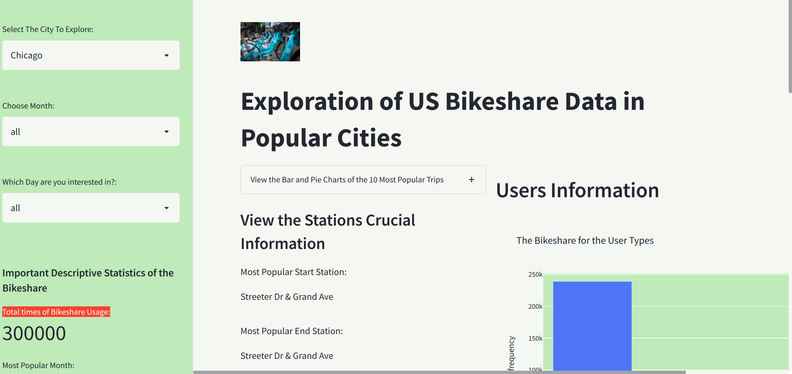
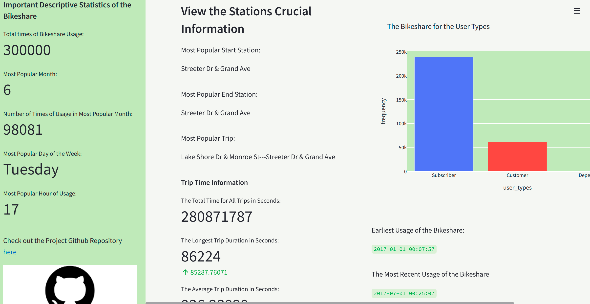
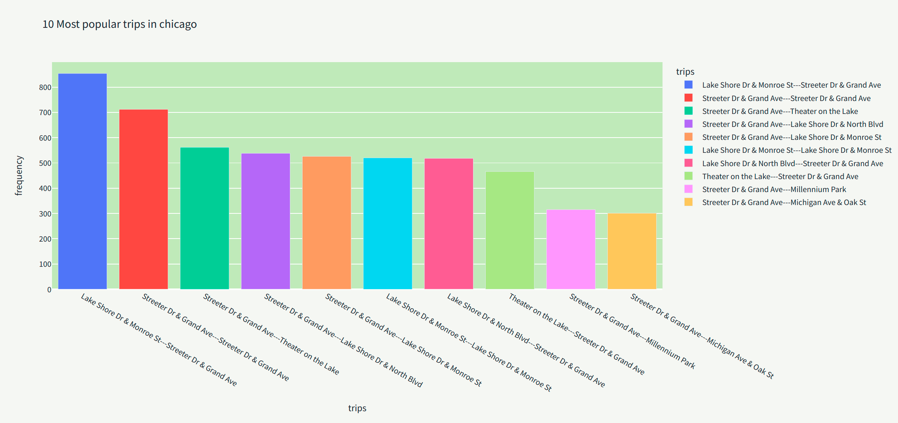
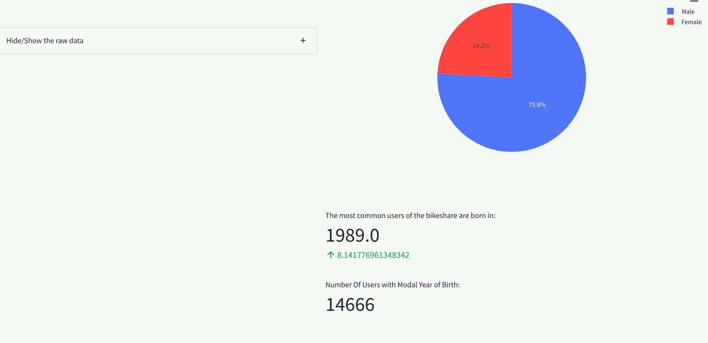

# Exploration of US BIKESHARE Data

This project aims at the exploration of the datasets used by a US Bike sharing company. The datasets are samples of bike sharing system usage in three US cities, namely:

1. New York City
2. Chicago
3. Washington, DC

The exploration of the datasets would uncover patterns in the bike sharing system. 

The project culminates with a web app built using [streamlit](https://streamlit.io/). The web app makes it easier to analyze and explore the bike sharing datasets from the cities and comparing their statistics. 

## Project Requirements/Installations

The core requirement for the project is python 3.7 or later version. In order to run the codes successfully and reproduce the results, install the packages by running the following code in your terminal:

`pip install -r requirements.txt`

### Datasets

The project contains three datasets from the above mentioned cities. They are sample datasets provided by [Motivate](https://www.motivateco.com/), a leader in American Urban Transportation and a major provider of bike sharing system. The datasets came clean thanks to [Udacity](https://www.udacity.com/) under whose tutelage I work. The datasets are in three files, namely:

```
1. chicago.csv
2. new_york_city.csv
3.  washington.csv
```

## Project Files

The following files are contained in the project directory:

    1. bikeshare.ipynb
    2. bikeshare_2.py
    3. bikeshare.py
    4. app.py

The first file is for development and not organized. The second file `bikeshare_2.py` is a standalone file that runs in the terminal and displays its outputs there. The third `bikeshare.py` goes hand in hand with the fourth `app.py` and both make up the web app for the data exploration.


## Run The Codes
Run the codes as follows in the terminal:

    1. python bikeshare_2.py
    2. streamlit run app.py
The first one produces the outputs in the terminal while the second sets up an app which can be accessed in a web browser at `http://localhost:8501/`. 


## The Web App

The web app is very simple and consists of a sidebar and two columns. In the sidebar, users are at liberty in selecting the `city, week, day` to explore. The sidebar also presents important generic metrics such as total times of Bikeshare Usage, the most popular month, number of times the bike share system was used in the popular month, the busiest day in a week and the most popular hour of the day.

The app also has checkboxes where users can click to view more details such as the raw datasets and some charts. 


## Results




